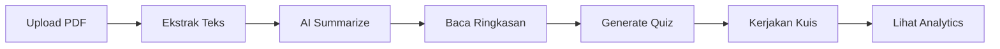

# 🎓 Belajarsama.ai

> Meja belajar digital untuk menandai, merangkum, dan menguasai materi — powered by AI.

[](https://nextjs.org/)
[](https://supabase.com/)
[](https://ai.google.dev/)
[](https://typescriptlang.org/)

---

## ✨ Fitur Utama

| Fitur | Deskripsi |
|-------|-----------|
| 📄 **Upload & Ekstrak PDF** | Unggah file PDF, teks diekstrak otomatis |
| 🤖 **AI Summarization** | Ringkasan otomatis menggunakan Google Gemini |
| 📝 **Quiz Generation** | Kuis pilihan ganda dibuat AI dari materi |
| 📅 **Jadwal Belajar** | Kalender bulanan interaktif dengan manajemen jadwal |
| 📊 **Analytics Dashboard** | Visualisasi skor & progres belajar dengan Recharts |
| 🌙 **Dark Mode Native** | Desain gelap premium "meja belajar" yang nyaman di mata |

## 🏗️ Tech Stack

```
Frontend     → Next.js 16 (App Router) + TypeScript + Tailwind CSS
Backend      → Supabase (PostgreSQL + Storage + Auth)
AI Engine    → Google Gemini API (@google/genai)
Charts       → Recharts
Animations   → Framer Motion
```

## 🚀 Memulai

### Prerequisites

- Node.js ≥ 18
- npm ≥ 9
- Akun [Supabase](https://supabase.com/) (gratis)
- [Google AI Studio API Key](https://aistudio.google.com/apikey)

### 1. Clone Repository

```bash
git clone https://github.com/heykhaje/Belajarsama.ai.git
cd Belajarsama.ai
npm install
```

### 2. Setup Environment Variables

```bash
cp .env.example .env.local
```

Edit `.env.local` dengan kredensial Anda:

```env
NEXT_PUBLIC_SUPABASE_URL=https://your-project.supabase.co
NEXT_PUBLIC_SUPABASE_ANON_KEY=your_anon_key
GEMINI_API_KEY=your_gemini_api_key
```

### 3. Setup Database

Buka **SQL Editor** di dashboard Supabase, _copy & paste_ seluruh isi file `supabase/schema.sql`, lalu klik **Run**.

Buat juga **Storage Bucket** dengan nama `materials` melalui menu **Storage** di dashboard Supabase.

### 4. Jalankan Development Server

```bash
npm run dev
```

Buka [http://localhost:3000](http://localhost:3000) di browser.

## 📂 Struktur Proyek

```
src/
├── app/
│   ├── page.tsx              # Dashboard utama
│   ├── actions.ts            # Server Actions (CRUD + AI)
│   ├── layout.tsx            # Root layout dengan Sidebar
│   ├── my-learning/          # Halaman daftar materi & ringkasan
│   ├── schedule/             # Kalender jadwal belajar
│   ├── analytics/            # Grafik & statistik kuis
│   └── quiz/[materialId]/    # Sesi kuis interaktif
├── components/
│   ├── Sidebar.tsx           # Navigasi samping (collapsible)
│   ├── QuizSession.tsx       # Client component untuk kuis
│   └── UploadPdfButton.tsx   # Tombol upload PDF
├── lib/
│   ├── ai/gemini.ts          # Integrasi Google Gemini API
│   └── supabase/client.ts    # Supabase client singleton
supabase/
└── schema.sql                # DDL untuk semua tabel
```

## 🧪 Alur Pengguna



## 📜 License

MIT — Dibangun dengan ❤️ untuk pelajar Indonesia.
